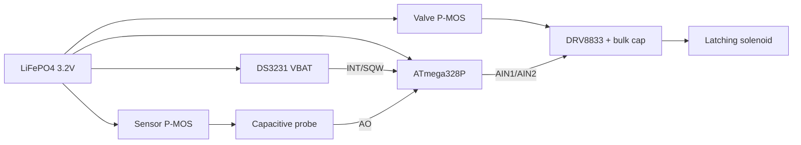

# MoistureController — Ultra Low-Power Embedded Reference

> **Current focus**: This is a **low-power embedded systems demonstration and reference project**.
> The active implementation lives in [`firmware/avr-ultra/`](firmware/avr-ultra/).
> It is a **Milestone 1** scheduled, fail-closed single-zone controller: latching-valve close pulse on every reset, DS3231 alarm wake, power-gated sensing, CRC-protected EEPROM, and the six-layer safety cycle from [REASONING.md](REASONING.md).
>
> Target: real-world **< 5–10 µA total system sleep current** on a genuine ATmega328P.
> Every architectural decision is documented in [REASONING.md](REASONING.md). The code carries `// REASONING.md §X.Y` cross-references.

---

**MoistureController** is an open-source project exploring how to build reliable, multi-month (or multi-year) battery- or solar-powered garden irrigation controllers using classic AVR microcontrollers.

The original 2023 versions used WDT polling or analog comparator techniques. The current work treats power consumption and failure resilience as first-class, non-negotiable requirements.

## Low-Power Embedded Design: Theory and Coding Techniques

This section explains the theory and concrete techniques used in the `firmware/avr-ultra/` reference implementation. It is intended as a practical guide for anyone building long-running battery or solar devices on AVR (or similar) microcontrollers.

### Why "Low Power" Is Hard

A garden controller spends **> 99.9 %** of its life doing nothing. Any current you burn in that "nothing" state is multiplied by thousands of hours.

- 1 mA continuous = ~8.76 Ah per year — enough to kill most small batteries in months.
- 10 µA continuous = ~88 mAh per year — easily sustainable with a small solar panel + 18650 or LiFePO4 cell.

The difference between a device that "mostly works" and one that truly runs for seasons is almost entirely made in the sleep state.

### The AVR Power Hierarchy

The ATmega328P (and most 8-bit AVRs) offer several successively deeper sleep modes. Only one is suitable for the < 10 µA target:

| Mode              | Typical current (3.3 V) | Wake sources                     | When to use |
|-------------------|-------------------------|----------------------------------|-------------|
| Active            | 2–5 mA                  | —                                | Never in the main loop |
| Idle              | ~0.5–1 mA               | Almost everything                | Rarely useful |
| Power-down        | 0.1–0.5 µA (BOD off)    | INT0/1, pin change, WDT (if on) | **The correct choice** |

To actually reach the 0.1–0.5 µA MCU number you must do several things **simultaneously** (this is exactly what `Power.h` implements):

1. **Sleep mode**: `SLEEP_MODE_PWR_DOWN`
2. **Brown-out Detector (BOD)**: Disabled (fuses + `sleep_bod_disable()` right before `sleep_cpu()`)
3. **Watchdog Timer**: Completely off (`wdt_disable()` + no `WDE` bit)
4. **Power Reduction Register**: `PRR = 0xFF` (turns off TWI, Timer, SPI, USART, ADC)
5. **Analog Comparator**: Disabled (`ACSR |= (1<<ACD)`)
6. **Digital input buffers**: Disabled on analog pins (`DIDR0 = 0x3F`)
7. **GPIO state**: All unused pins as outputs driving low (or inputs with pull-ups explicitly disabled). Floating inputs or pull-ups are major leakage sources. **Exceptions**: RTC INT, user button, VBAT divider, SDA/SCL — driving those as outputs fights pull-ups or the divider.
8. **AREF**: Only a small capacitor to GND (direct connection to VCC creates a ~100–150 µA path in some configurations)

Missing any one of these items usually costs tens or hundreds of microamps.

### System-Level Techniques (Beyond the MCU)

Even a perfectly sleeping MCU is useless if the rest of the system is wasting power.

- **Power gating** — Every sensor and actuator rail must be switched with a P-MOSFET (or load switch) so it draws zero current when not in use. The `Power.h` rail helpers exist for exactly this reason.
- **Latching (bistable) valves** — A conventional 5 V NC solenoid held open for 10 seconds can cost 4–8 joules per watering event. A latching 9/12 V solenoid needs only a 30–100 ms polarity pulse (≈ 0.05–0.2 J). The energy difference is roughly two orders of magnitude. Layer 0 must **pulse close**, not merely de-energize the H-bridge: a bistable valve left open stays open.
- **RTC scheduling instead of WDT polling** — The DS3231 in true VBAT mode (~1–3 µA) + alarm interrupt lets the MCU sleep for hours or days between checks. WDT 8-second ticks force the MCU to wake far more often than necessary and have noticeable variance.
- **Bulk capacitance for pulses** — A large low-ESR capacitor near the H-bridge supplies the high current needed for a latching pulse so the battery and wiring see only a modest spike.
- **Battery chemistry** — LiFePO4 is preferred for the Ultra target (safer, flatter curve, longer life, can often run "direct" to 3.3 V logic).

### Common Deadly Mistakes (and How We Avoid Them)

| Mistake                              | Typical cost     | How the Ultra code prevents it |
|--------------------------------------|------------------|--------------------------------|
| Leaving the WDT running              | 5–20 µA+        | Explicit `wdt_disable()` early in `setup()` and again in `power_init_lowest_leakage()` |
| Forgetting `DIDR0`                   | 50–150 µA       | `DIDR0 = 0x3F` on every low-power entry |
| Pins left as inputs with pull-ups    | 30–100 µA each  | Full GPIO sweep to OUTPUT+LOW, with documented exceptions |
| Driving SDA/SCL or VBAT as outputs   | 50–200 µA       | Those pins stay INPUT |
| Sensor VCC always powered            | 2–5 mA          | P-MOSFET power gate; rail is only enabled for a few milliseconds during a reading |
| Using `delay()` / `millis()` after `PRR=0xFF` | hung / wrong timing | Pulse and sample waits use `_delay_ms` busy-wait (`Utils.h`) |
| Assuming "reset = immediate application start" | Layer 0 violation | Bootloader window is documented; hardware "manual close" RC network is the last safety net |
| De-energizing a latching valve instead of pulsing close | flood | `valve_force_close()` on every reset |
| Counterfeit ATmega chips             | 50–300 µA sleep | Strong warning in docs + measurement checklist ("genuine silicon only") |

### How to Read the Reference Implementation

The code in `firmware/avr-ultra/` is a teaching example as well as a working controller:

- `power_init_lowest_leakage()` is the complete AVR sleep recipe, commented back to REASONING.md.
- Layer 0 (close pulse) is the first hardware action in `setup()`, before Serial, I2C, or EEPROM.
- Debug output is compile-time disabled (`#if ENABLE_DEBUG_SERIAL`) so it contributes zero current in production builds.
- Decision math (CRC, hysteresis, windows) lives in `Logic.h` and is covered by host tests.

When adding peripherals: **if it is not needed right now, its power rail must be off and its pins must be in a zero-leakage state.**

### Further Reading

- [REASONING.md](REASONING.md) — the single source of truth for every power and robustness decision
- Atmel/Microchip AVR datasheet (Power Consumption and Sleep Modes)
- Nick Gammon’s AVR sleep-mode articles
- DS3231 datasheet (VBAT vs VCC current, alarm-on-battery control bits)

---

## Current Code (Milestone 1)

```
firmware/avr-ultra/
├── avr-ultra.ino        # setup() / loop() only
├── Config.h             # pin map, thresholds, compile flags
├── Types.h              # states, faults, EEPROM structs
├── Logic.h              # CRC / hysteresis / window math
├── Policy.h             # persist slot choice + six-layer cycle (host-tested)
├── Power.h              # sleep recipe, rail gates, Vbat ADC
├── Utils.h              # busy-wait, I2C on/off + bus recover
├── Valve.h              # latching open/close pulses
├── Sensor.h             # gated analog + optional STEMMA
├── RTC_DS3231.h         # VBAT-friendly alarm on INT
├── Persist.h            # EEPROM adapter
├── Safety.h             # I/O around Policy.h
└── StateMachine.h       # boot / wake / FAULT-clear
```

Open `firmware/avr-ultra/` in the Arduino IDE, select an ATmega328P board (Nano, Pro Mini, Uno), and compile. Or use the Makefile (below).

The sketch file is named `avr-ultra.ino` to match the folder, which `arduino-cli` requires.

Legacy 2023 code remains at the repo root (`MoistureController.ino`) and in git history. It is not the active target.

## Hardware (Ultra)


Vector source: [CircuitDiagram.svg](./CircuitDiagram.svg). Regenerated with `python3 tools/render_circuit_diagram.py`.

| Function | Pin | Notes |
|----------|-----|--------|
| RTC INT/SQW | D2 (INT0) | Open-drain, internal pull-up plus module pull-up. PWR_DOWN only wakes on **LOW level**, not falling edge |
| FAULT-clear button | D3 (INT1) | To GND, `INPUT_PULLUP`, hold 2 s |
| Valve P-MOS gate | D7 | HIGH = rail off |
| Sensor P-MOS gate | D8 | HIGH = rail off |
| H-bridge AIN1 / AIN2 | D9 / D10 | Both LOW = coil de-energized |
| Moisture analog | A0 | Probe on the gated sensor rail |
| Vbat divider | A2 | 100 k / 100 k, **must stay INPUT** |
| I2C SDA / SCL | A4 / A5 | DS3231 0x68, optional STEMMA 0x36 |

A DS3231 is required for scheduled wakes. Without a valid clock the firmware enters `FAULT` (`RTC_LOST`) and keeps the valve closed. Hold the button 2 s after the sensor reads plausibly to clear `FAULT`.

**Boards:** the firmware is written for a bare or stripped ATmega328P at 3.3 V with no regulator, no USB-serial chip, and the power LED removed. An unmodified Nano or Pro Mini will **not** reach the sleep-current target.

STEMMA VIN, if used, must sit on the **gated** sensor rail — tying it to always-on 3.3 V destroys the budget.

If the valve moves the wrong way on first bring-up, swap `VALVE_CLOSE_IN1` / `VALVE_CLOSE_IN2` in `Config.h`.



## Building

Tracked build files (these used to 404 on GitHub):

- [Makefile](Makefile) — default workflow
- [cmake/avr-toolchain.cmake](cmake/avr-toolchain.cmake) — native avr-gcc toolchain
- [CMakeLists.txt](CMakeLists.txt)

### Makefile (recommended)

Requires [`arduino-cli`](https://arduino.github.io/arduino-cli/) and the `arduino:avr` core (`arduino-cli core install arduino:avr`).

```bash
git clone https://github.com/jrfranks/MoistureController.git
cd MoistureController

make            # compile firmware/avr-ultra
make test       # host unit tests (Logic + persist slots + six-layer cycle)
make legacy     # compile the 2023 root sketch
make check      # ultra + legacy + test
make help
```

There is no simavr / CTest simulation of the 2023 vintage. `make test` runs the host tests in [`tests/host/`](tests/host/).

### CMake + arduino-cli

```bash
cmake -S . -B build -DUSE_ARDUINO_CLI=ON
cmake --build build
ctest --test-dir build --output-on-failure
```

### Native avr-gcc (toolchain check)

```bash
cmake -S . -B build-native -DUSE_NATIVE_AVR=ON \
      -DCMAKE_TOOLCHAIN_FILE=cmake/avr-toolchain.cmake
cmake --build build-native
```

This compiles `Logic.h` with avr-gcc. It is not a substitute for `make ultra` (the sketch still needs the Arduino core, which `arduino-cli` provides).

## License

MIT. See [LICENSE](LICENSE).

## Credits

John Franks (johnf@sveltesoft.com)

---

## Appendix — 2023 breadboard prototype (historical)

The 2023 sketch at the repo root used WDT 8 s ticks, an always-on analog probe on A0, a potentiometer on A1, and a conventional solenoid on D13. README text from that era described a comparator library, pin D0, missing `CircuitDiagram.png`, `make test` against simavr, and libraries (`LowPower`, `analogComp`) that the tree no longer uses. That documentation was wrong relative to the code; it is not the Ultra architecture.

Original parts, for archaeology only: Gikfun-style capacitive probe, 10 kΩ pot, 5 V NC solenoid, IRLB8743 + 1N4004, Arduino Nano, 5 V supply.
