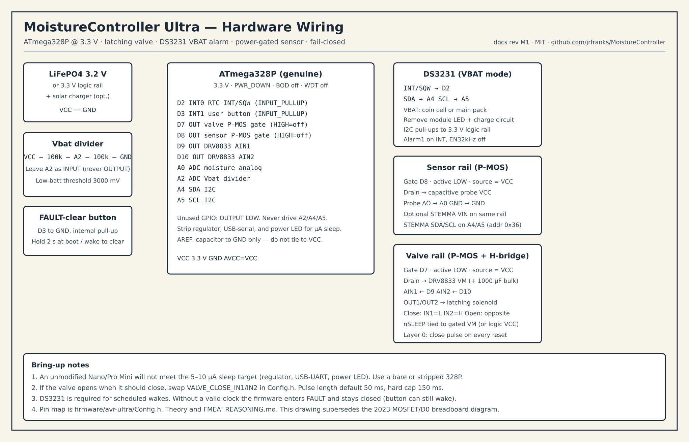

# MoistureController — Ultra Low-Power Embedded Reference

> **Current focus**: This is a **low-power embedded systems demonstration and reference project**.
> The active, production-grade implementation lives in `firmware/avr-ultra/`.
> It demonstrates how to achieve real-world **< 5–10 µA total system sleep current** on an ATmega328P while maintaining strong robustness guarantees (defense-in-depth, fail-closed on almost any fault).
>
> All architectural decisions, power budgets, failure-mode analysis, and coding rationale are documented in [REASONING.md](REASONING.md). The code itself carries extensive `// REASONING.md §X.Y` cross-references.

---

**MoistureController** is an open-source project exploring how to build reliable, multi-month (or multi-year) battery- or solar-powered garden irrigation controllers using classic AVR microcontrollers.

The original 2023 versions used WDT polling or analog comparator techniques. The current work focuses on a much more rigorous "Ultra" target that treats power consumption and failure resilience as first-class, non-negotiable requirements.

## Low-Power Embedded Design: Theory and Coding Techniques

This section explains the theory and concrete techniques used in the `firmware/avr-ultra/` reference implementation. It is intended as a practical guide for anyone building long-running battery or solar devices on AVR (or similar) microcontrollers.

### Why "Low Power" Is Hard

A garden controller spends **> 99.9 %** of its life doing nothing. Any current you burn in that "nothing" state is multiplied by thousands of hours.

- 1 mA continuous = ~8.76 Ah per year — enough to kill most small batteries in months.
- 10 µA continuous = ~88 mAh per year — easily sustainable with a small solar panel + 18650 or LiFePO4 cell.

The difference between a device that "mostly works" and one that truly runs for seasons is almost entirely made in the sleep state.

### The AVR Power Hierarchy

The ATmega328P (and most 8-bit AVRs) offer several successively deeper sleep modes. Only one is suitable for the < 10 µA target:

| Mode              | Typical current (3.3 V) | Wake sources                     | When to use |
|-------------------|-------------------------|----------------------------------|-------------|
| Active            | 2–5 mA                  | —                                | Never in the main loop |
| Idle              | ~0.5–1 mA               | Almost everything                | Rarely useful |
| Power-down        | 0.1–0.5 µA (BOD off)    | INT0/1, pin change, WDT (if on) | **The correct choice** |

To actually reach the 0.1–0.5 µA MCU number you must do several things **simultaneously** (this is exactly what `Power.h` implements):

1. **Sleep mode**: `SLEEP_MODE_PWR_DOWN`
2. **Brown-out Detector (BOD)**: Disabled (fuses + `sleep_bod_disable()` right before `sleep_cpu()`)
3. **Watchdog Timer**: Completely off (`wdt_disable()` + no `WDE` bit)
4. **Power Reduction Register**: `PRR = 0xFF` (turns off TWI, Timer, SPI, USART, ADC)
5. **Analog Comparator**: Disabled (`ACSR |= (1<<ACD)`)
6. **Digital input buffers**: Disabled on analog pins (`DIDR0 = 0x3F`)
7. **GPIO state**: All unused pins as outputs driving low (or inputs with pull-ups explicitly disabled). Floating inputs or pull-ups are major leakage sources.
8. **AREF**: Only a small capacitor to GND (direct connection to VCC creates a ~100–150 µA path in some configurations)

Missing any one of these items usually costs tens or hundreds of microamps.

### System-Level Techniques (Beyond the MCU)

Even a perfectly sleeping MCU is useless if the rest of the system is wasting power.

- **Power gating** — Every sensor and actuator rail must be switched with a P-MOSFET (or load switch) so it draws zero current when not in use. The `Power.h` rail helpers exist for exactly this reason.
- **Latching (bistable) valves** — A conventional 5 V NC solenoid held open for 10 seconds can cost 4–8 joules per watering event. A latching 9/12 V solenoid needs only a 30–100 ms polarity pulse (≈ 0.05–0.2 J). The energy difference is roughly two orders of magnitude.
- **RTC scheduling instead of WDT polling** — The DS3231 in true VBAT mode (~1–3 µA) + alarm interrupt lets the MCU sleep for hours or days between checks. WDT 8-second ticks force the MCU to wake far more often than necessary and have noticeable variance.
- **Bulk capacitance for pulses** — A large low-ESR capacitor near the H-bridge supplies the high current needed for a latching pulse so the battery and wiring see only a modest spike.
- **Battery chemistry** — LiFePO4 is preferred for the Ultra target (safer, flatter curve, longer life, can often run "direct" to 3.3 V logic).

### Common Deadly Mistakes (and How We Avoid Them)

| Mistake                              | Typical cost     | How the Ultra code prevents it |
|--------------------------------------|------------------|--------------------------------|
| Leaving the WDT running              | 5–20 µA+        | Explicit `wdt_disable()` early in `power_init_lowest_leakage()` and again in `setup()` |
| Forgetting `DIDR0`                   | 50–150 µA       | `DIDR0 = 0x3F` on every low-power entry |
| Pins left as inputs with pull-ups    | 30–100 µA each  | Full GPIO sweep to OUTPUT+LOW (except the documented exceptions for RTC INT and power gates) |
| Sensor VCC always powered            | 2–5 mA          | P-MOSFET power gate; rail is only enabled for a few milliseconds during a reading |
| Using `delay()` or `millis()` during sleep | Wastes time + power | No blocking delays in the sleep path; RTC provides real calendar time |
| Assuming "reset = immediate application start" | Layer 0 violation | On boards with a bootloader there is a 1–2 s window. Documented + hardware "manual close" RC network recommended as the ultimate safety net |
| Counterfeit ATmega chips             | 50–300 µA sleep | Strong warning in docs + measurement checklist ("genuine silicon only") |

### How to Read the Reference Implementation

The code in `firmware/avr-ultra/Power.h` and `MoistureController.ino` is deliberately written as a **teaching example** as well as a working foundation:

- `power_init_lowest_leakage()` contains the complete AVR recipe with comments pointing back to the exact sections of REASONING.md.
- Layer 0 (forced safe valve state) is the very first thing that happens in `setup()`, before any Serial, any I2C, any sensor work.
- Debug output is compile-time disabled by default (`#if ENABLE_DEBUG_SERIAL`) so it contributes zero current in production builds.
- The structure (thin `.ino` + focused `.h` modules) makes it easy to see where power is being spent and where it is being saved.

When adding new peripherals in later milestones, the rule is simple: **if it is not needed right now, its power rail must be off and its pins must be in a zero-leakage state.**

### Further Reading

- [REASONING.md](REASONING.md) — the single source of truth for every power and robustness decision in this project.
- Atmel/Microchip AVR datasheet (Power Consumption and Sleep Modes chapters)
- Nick Gammon’s classic AVR sleep mode articles (still the best practical reference in 2025)
- The DS3231 datasheet (especially the VBAT vs VCC current numbers and the control register settings for alarm-on-battery)

---

## Current Code

The reference implementation lives here:

```
firmware/avr-ultra/
├── MoistureController.ino   # Thin entry point (setup/loop)
├── Config.h
├── Types.h
├── Power.h                  # The low-power recipe + rail control
```

Open that folder in the Arduino IDE, select an ATmega328P board (Nano, Pro Mini, Uno), and compile. The sketch demonstrates correct Layer 0 behavior and the full lowest-leakage configuration on every reset.

Legacy code from 2023 (the original WDT polling sketch and the comparator experiments) remains in git history for reference but is no longer the active target.

## Installation & Hardware (Legacy / Historical)

> The text below describes the **2023 breadboard prototype**. It is preserved for historical interest only.
> The active development direction is a proper low-power custom PCB for the Ultra target (see the production plan and the future `hardware/kicad/` work).
>
> **Important**: The current reference firmware in `firmware/avr-ultra/` is written for a bare or stripped ATmega328P running at 3.3 V with no regulator, no USB-serial chip, and the power LED removed. An unmodified Arduino Nano or Pro Mini will **not** reach the target sleep current because of the onboard components. This is expected and documented.

### Original 2023 Components (for reference only)

- Moisture sensor (capacitive, e.g. Gikfun-style)
- 10 kΩ potentiometer (threshold)
- 5 V normally-closed solenoid valve + IRLB8743 logic MOSFET + 1N4004 flyback diode
- Arduino Nano (or compatible ATmega328P board)
- Breadboard + jumper wires
- 5 V (or regulated higher voltage) power supply

The original code used direct AVR sleep + WDT or the analog comparator library. Those approaches are no longer the target architecture.

## Installation
To use this program in a real environment, you will need an Arduino board and the following components:
- Moisture sensor
- Potentiometer
- Water Valve
- 1N4004 Diode
- Circuit Board
  - Breadboard
    - Suitable size breadboard
    - Jumper wires
- Power supply

## Hardware Dependencies
### Arduino Controller
Arduino Nano: This is the microcontroller board used for development.

The comparator library works with a wide variety of Atmel microcontrollers and Arduino boards:
- Attiny2313/4313 [1]
  - Due to the fact that these MCUs don't have an integrated ADC, only AIN1 is allowed for AIN-.
- Attiny24/44/84
- Attiny25/45/85
- Atmega344/644/1284
- Atmega8
  - Some SMD versions of this chip have 2 extra analog input pins; so, to be able to use them inside the library, please edit the analogComp.h file and change the value from 6 to 8 of the following compiler's directive: ```code
#define ATMEGAx8
#define NUM_ANALOG_INPUTS 6
```
- Atmega48/88/168/328 (Arduino UNO/NANO)
- Atmega640/1280/1281/2560/2561 (Arduino MEGA)
- Atmega32U4 (Arduino Leonardo/Micro)
  - Don't use analog input lines A2 & A3 because they are not phisically connected to external pins on Leonardo & Micro boards

### Moisture Sensor
Amazon: https://www.amazon.com/Gikfun-Capacitive-Corrosion-Resistant-Detection/dp/B07H3P1NRM

Moisture Sensor:
This part allows the Arduino to read the moisture level.
- Connect GND pin to Ground
- Connect the VCC pin of the moisture sensor to 5V.
- Connect the analog output pin to the Arduino's Analog Input pin A0 on the Arduino.

### Potentiometer (POT)
Amazon: https://www.amazon.com/uxcell-Variable-Resistors-Potentiometer-Potentiometers/dp/B07W3HGDGS

Connect one end of the potentiometer to 5V on the Arduino Nano, the other end to Ground (GND), and the middle pin (the wiper) to Analog Input pin A1. This will allow you to adjust the voltage level at A1, effectively setting the threshold for the comparator.

### Water Valve
5v Normally closed
- https://www.amazon.com/uxcell-Miniature-Solenoid-Normally-Opened/dp/B07XDS142G
  Other valves can be used as long as they are normally closed and is powered by a matching power supply.
- MOSFET: IRLB8743PBF or equivalent
This is a logic-level MOSFET, meaning it can be fully turned on with a gate-source voltage of 5V. It has a continuous drain current (Id) rating of 78A, which is well above the 0.46 required by the solenoid and is large enough to handle 12V solenoids.

'''code
Wiring Diagram:

  Vs ----+---[Solenoid]---+---[MOSFET Source]--+
         |                |                    |
         +----[<Diode]----+---[MOSFET Drain]---+-- GND
                                               |
         +----[Resistor]-----------------------+
         |
  D0 ----+--------------------[MOSFET Gate]

Notes:
  * If Vs > 12v then a voltage regulator should be used to
    step down the power to 5V for the arduino.
  * If Vs > 5v the the arduino should be properly cooled.
'''

### Decoupling Capacitors
Decoupling capacitors help to smooth out any high-frequency noise on the power supply lines.
- Connect a 100nF (0.1uF) ceramic capacitor between the 5V and GND pins close to the Arduino.
- Connect a 100nF capacitor between the VCC and GND pins of the moisture sensor.
- Connect a 100nF capacitor between the D0 and GND pins of the water valve.

Remember to always double-check your connections and ensure that your components are compatible with the 5V logic level of the Arduino Nano. Always power off your circuit before making or changing connections to avoid damaging your components.

### Hardware Setup


Connections:
- Moisture sensor output: A0
- Potentiometer: A1
- Valve to pin D0
- Make sure to also connect power and ground to each component.

## Software Dependencies
This project uses the following Arduino libraries:

- LowPower
- analogComp

## Building the Project
This project uses CMake as its build system. To build the project, follow these steps:

1. Clone the repository:

```bash
git clone https://github.com/jrfranks/MoistureController.git
cd MoistureController
```

2. Create a build directory and navigate to it:

```bash
mkdir build
cd build
```

3. Configure the project with CMake. You can specify the build type (`Debug`, `Release`, or `Test`) with the `-DCMAKE_BUILD_TYPE` option:

```bash
cmake -DCMAKE_BUILD_TYPE=Debug ..
```

4. Build the project:

```bash
make
```

## Testing

To run the simulation tests after building the project, use the following command:

```bash
make test
```

## License

This project is licensed under the MIT License. See the `LICENSE` file for more details.
```

## Credits
This program was developed by John Franks (johnf@sveltesoft.com).
